## Readme.md

本项目**Python-Noob**参考了《<u>Python For Kids - A Playful Introduction to Programming</u>》(Produced By Jason R. Briggs)按照《<u>PFK lessonplans full</u>》（nostarch.com/pfk) 完成的项目。

### Lab1. Hello World!

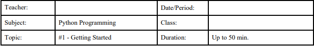

Activities:

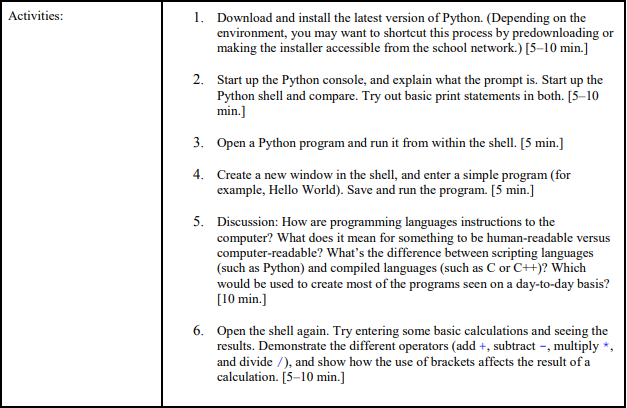

[Click Me To See The Lab1](http://hqsmartbot.com:10081/WuPeixi/Python-Noob/src/master/lab1/)

### Lab2. Storing Things in Python

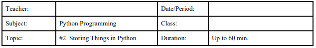

Activities:

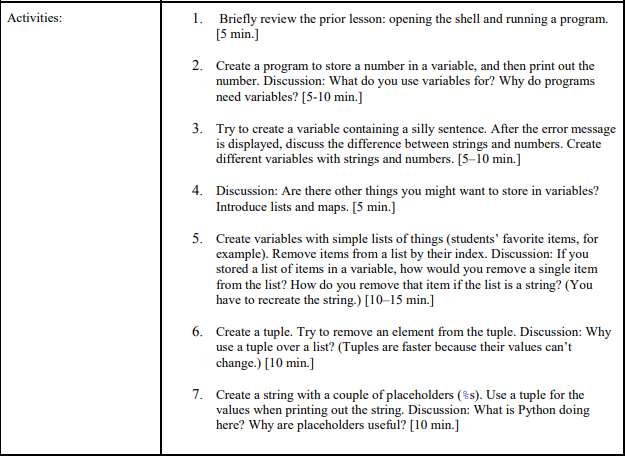

[Click Me To See The Lab2](http://hqsmartbot.com:10081/WuPeixi/Python-Noob/src/master/lab2)

### Lab3. Drawing with the Turtle

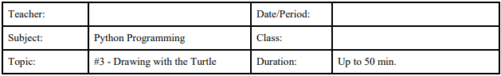

Activities:

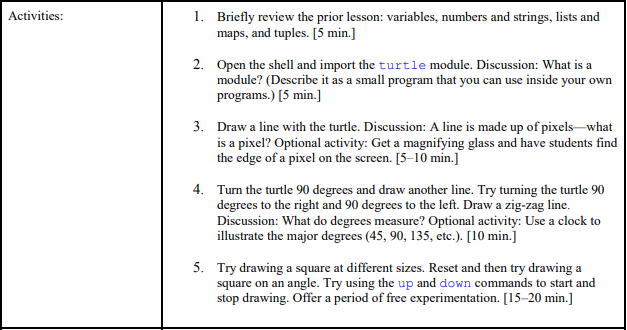

[Click Me To See The Lab3](http://hqsmartbot.com:10081/WuPeixi/Python-Noob/src/master/lab3)

### Lab4. Control Statements

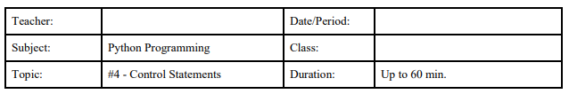

Activities:

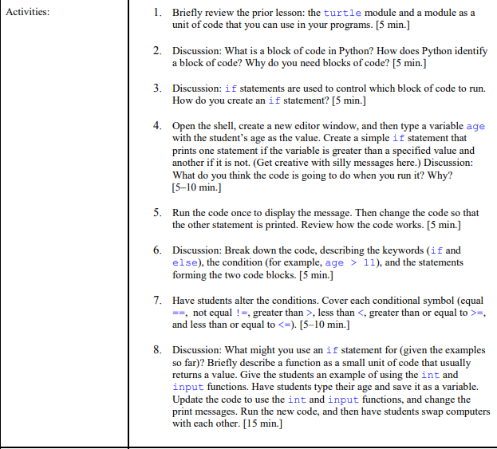

[Click Me To See The lab4](http://hqsmartbot.com:10081/WuPeixi/Python-Noob/src/master/lab4)

### Lab5. Control Statements

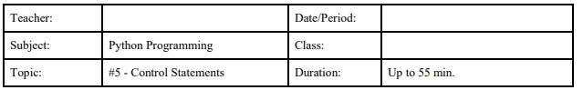

Activities:

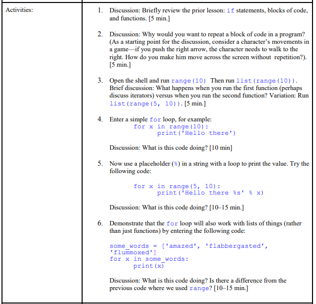

[Click Me To See The Lab5](http://hqsmartbot.com:10081/WuPeixi/Python-Noob/src/master/lab5)

### Lab6. Code Reuse

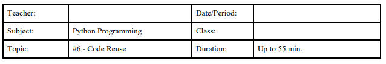

Activities:

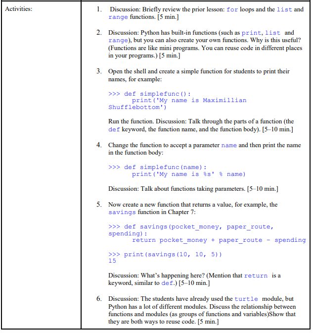

[Click Me To See The Lab6](http://hqsmartbot.com:10081/WuPeixi/Python-Noob/src/master/lab6)

## END