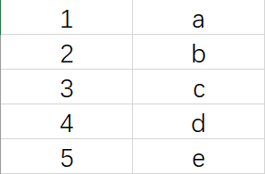
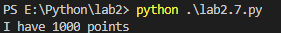

## Q&A

### 2.

Create a program to store a number in a variable, and then print out the number. (**lab2.2.py**)

Discussion: What do you use variables for? Why do programs need variables? 

A:因为变量的数值可以存储在存储器内，程序运行时需要有一些数量进行变化，所以程序需要变量。

### 3.

Try to create a variable containing a silly sentence. After the error message is displayed. Create different variables with strings and numbers. 

(**lab2.3.py**)

Discuss the difference between strings and numbers:

A:string变量是字符串变量，储存的是字符串的内容；而number变量是数学变量，储存的是数据。

### 4.

Discussion: Are there other things you might want to store in variables?

A:各种数值和字符串

Introduce lists and maps.

Lists:就是一个列表，这个列表中储存着不同的数值，在list中在不同的位置，例如第一项的位置就是0，第二项的位置就是1，以此类推。

Maps:就是类似图表的东西，有点儿像Excel，一行对应一组变量，查找变量的时候就是查找前置（前面那个变量）然后获取后面那个变量的值。


=======
### 5.

Create variables with simple lists of things (students’ favorite items, for example). Remove items from a list by their index. (**lab2.5.py**)

Discussion: If you stored a list of items in a variable, how would you remove a single item from the list? How do you remove that item if the list is a string? (You have to recreate the string.)

A:获得想要移除的项在列表中的位置，然后使用

```python
del %element[%num]
```

的方式将其移除列表，例如

```python
element = [1,2,3,4,5,6,7,8,9,10]
#此时想要移除5这个数字，此数字在列表中为第5项。则使用：
del element[4]
print (element)
```

此处输出的结果为:``[1,2,3,4,6,7,8,9,10]``

### 6.

Create a tuple. Try to remove an element from the tuple. Discussion: Why use a tuple over a list?

A:因为数组内的元素不能进行修改但是更快。

### 7.

Create a string with a couple of placeholders (%s). Use a tuple for the values when printing out the string. (**lab2.7.py**)

Discussion: What is Python doing here? Why are placeholders useful?

A:占位符在这里起到了替换的作用，将

```python
num=1000
out = 'I have %s points'
print (out % num)
```

out处的%s替换成了num，输出的效果如下：


=======


因为占位符可以替换语句中的待定变量，所以占位符比较有用。

