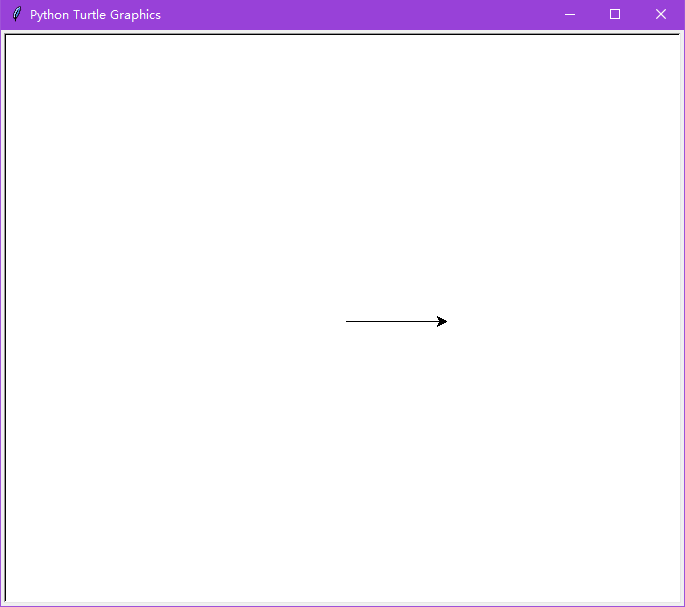
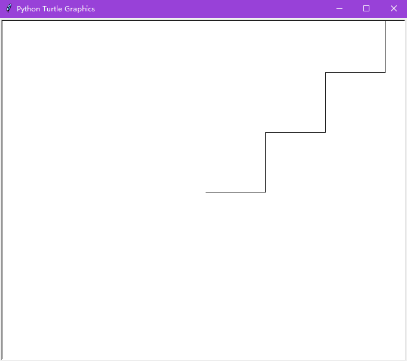

## Q&A

### 2.

Open the shell and import the turtle module. Discussion: What is a module? (Describe it as a small program that you can use inside your own programs.)

A:模块是类似C++中的运行库的一个东西，有了这个模块，程序才能运行。

​	

### 3.

Draw a line with the turtle. (**lab3.3.py**)

```python
import turtle
t=turtle.Pen()
t.forward(100)
```



Discussion: A line is made up of pixels—what is a pixel? Optional activity: Get a magnifying glass and have students find the edge of a pixel on the screen. 

A:计算机的显示都是由一个一个像素点构成的，像素是显示的基础，决定了图像显示出来的样子。


### 4.

Turn the turtle 90 degrees and draw another line. Try turning the turtle 90 degrees to the right and 90 degrees to the left. Draw a zig-zag line. 

```python
import turtle
t = turtle.Pen()
t.forward(100)
t.left(90)
t.forward(100)
t.right(90)
t.forward(100)
t.left(90)
t.forward(100)
t.right(90)
t.forward(100)
t.left(90)
t.forward(100)
t.right(90)

```



Discussion: What do degrees measure? 

A:90°

### 5.

Try drawing a square at different sizes. Reset and then try drawing a square on an angle. Try using the up and down commands to start and stop drawing. Offer a period of free experimentation. (**lab3.5.py**)

```python
import turtle
s=turtle.Pen()
s.reset()
s.up()
s.forward(100)
s.left(90)
s.forward(100)
s.left(90)
s.forward(100)
s.left(90)
s.forward(100)
s.left(90)
s.down()
s.forward(200)
s.left(90)
s.forward(200)
s.left(90)
s.forward(200)
s.left(90)
s.forward(200)
s.left(90)
```

