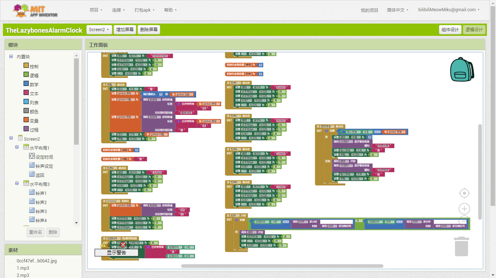
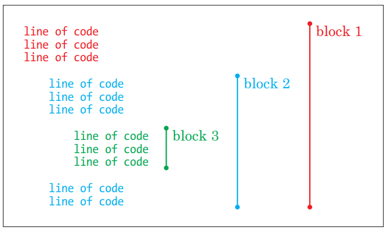
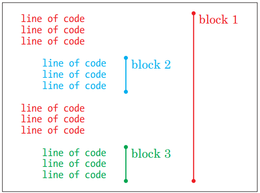
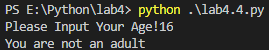

## Q&A

### 2.

Discussion: What is a block of code in Python? How does Python identify a block of code? Why do you need blocks of code?

A: 方块型语言（图为利用了方块型编程方式的MIT APP Inventor）



就像是一块一块的积木，不同方块的父子级关系会导致程序运行的不同，就好像说是文档里的这两张图（不同顺序下的方块语言逻辑不同）





方块型带来的好处就是可以清晰地看出不同的区块下不同的逻辑

### 3.

Discussion: if statements are used to control which block of code to run. How do you create an if statement? 

首先需要利用python的if语言的特性

```python
a = 1
if a>0:
    print (a)	#Block1
else:
    print (0)	#Block2
```

当if的条件成立，那么就运行Block1，否则运行Block2。在编程中，if语句的格式总是遵从以下格式：

```python
if <条件>:
    <命令语句>
elif <条件>:
    <命令语句>
else:
    <命令语句>
```


### 4.

Open the shell, create a new editor window, and then type a variable age with the student’s age as the value. Create a simple if statement that prints one statement if the variable is greater than a specified value and another if it is not. (Get creative with silly messages here.) Discussion: What do you think the code is going to do when you run it? Why?

```python
age = int(input("Please Input Your Age!"))
if age > 18:
    print("You are an adult")
else:
    print("You are not an adult")
```

**Output**



