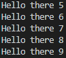
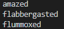

## Q&A

### 2.

Discussion: Why would you want to repeat a block of code in a program? (As a starting point for the discussion, consider a character’s movements in a game—if you push the right arrow, the character needs to walk to the right. How do you make him move across the screen without repetition?)

A:因为在程序的运行当中，有一部分的代码需要重复多次，所以就需要重复运行。

### 3.

Open the shell and run range(10) Then run list(range(10)).  Variation: Run list(range(5, 10))

```python
for x in range(0,10):
    print(x)
print ()
for y in list(range(0,10)):
    print(y)
print ()
for z in list(range(5,10)):
    print (z)
```

**Output**

``0
1
2
3
4
5
6
7
8
9``

``0
1
2
3
4
5
6
7
8
9``

``5
6
7
8
9``

Brief discussion: What happens when you run the first function (perhaps discuss iterators) versus when you run the second function?

A:好像并没有发生什么，但是在代码上相比实现同样的功能第二种方式的代码占用存储更大。

### 4.

Enter a simple for loop, for example:

```python
for x in range(10):
print('Hello there')
```

Discussion: What is this code doing? 

A:这串代码使得**Hello there**字符重复出现了10次。

### 5.

Now use a placeholder (%) in a string with a loop to print the value. Try the following code:

```python
for x in range(5, 10):
print('Hello there %s' % x)
```


Discussion: What is this code doing? 

**Output:**



此处的代码承担了Hello there 后面的数字输出。

### 6.

Demonstrate that the for loop will also work with lists of things (rather than just functions) by entering the following code: 

```python
some_words = ['amazed', 'flabbergasted', 'flummoxed']
for x in some_words:
print(x)
```


Discussion: What is this code doing? Is there a difference from the previous code where we used range?

**Output**



此处的代码循环承担了列表中项目的位置的工作，输出some_words列表中的单词。

