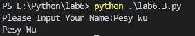
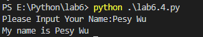

## Q&A

### 2.

Discussion: Python has built-in functions (such as print, list and range), but you can also create your own functions. Why is this useful? (Functions are like mini programs. You can reuse code in different places in your programs.) 

A:因为原本自带的函数可能会不满足个人的需要，还有另外一种原因就是为了简化程序，不能把大量的程序字段反复放在软件代码内的不同位置（因为这样会徒增软件的大小），所以需要拥有自己定义函数的一个功能。


### 3.

Open the shell and create a simple function for students to print their names, for example:
```python
def simplefunc():
print('My name is Maximillian Shufflebottom')
```


**MyCode**

```python
def printname(name):
    print(name)
Yourname=input("Please Input Your Name:")
printname(Yourname)
```


**output**



Run the function. Discussion: Talk through the parts of a function (the def keyword, the function name, and the function body).

A:

```python
def #def Keyword
printname #function name
print(name) #funciton body
```

### 4.

Change the function to accept a parameter name and then print the name
in the function body:

```python
def simplefunc(name):
 print('My name is %s' % name)
```


**Output**



Discussion: Talk about functions taking parameters.

A:

```python
def #def Keyword
print('My name is %s' % name) #function body
```


### 5.

Now create a new function that returns a value, for example, the
savings function in Chapter 7:
```python
def savings(pocket_money, paper_route, spending):
 return pocket_money + paper_route – spending
 print(savings(10, 10, 5))
```


Discussion: What’s happening here? (Mention that return is a keyword, similar to def.)

```python
def #def keywords
savings # funciton name
return pocket_money + paper_route – spending # function body
```

### 6.

Discussion: The students have already used the turtle module, but Python has a lot of different modules. Discuss the relationship between functions and modules (as groups of functions and variables)Show that they are both ways to reuse code. 


A:函数是调用模块的一个过程，没有模块的话函数将无法调用。


### 7.

Have the student import the time module and print the result of the asctime function. Then import the sys module and use the readline function of the stdin object (sys.stdin.readline()). Discussion: Check the students’ understanding of what’s happening here. (Focus on the fact that stdin is a variable in the sys module—don’t go into objects at this point.) 